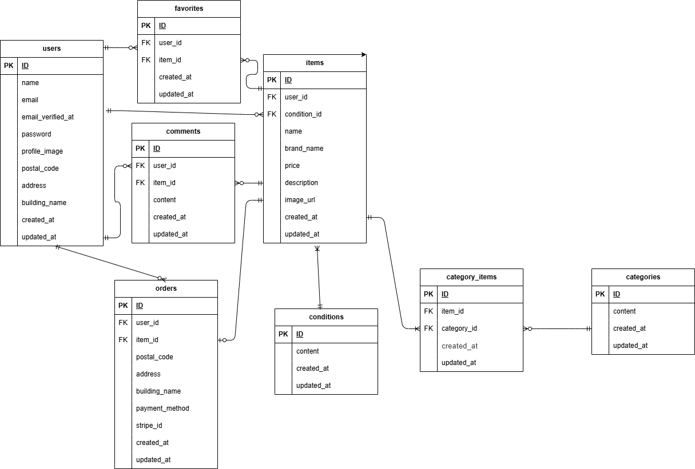

## アプリケーション名

KURAHASHI-free-market

# フリマアプリ

商品を出品・購入できるフリーマーケットアプリです。

会員登録、ログイン、商品検索、マイリスト、コメント、商品出品、プロフィール編集、Stripe決済、メール認証などの機能を実装しています。

## 環境構築

### Dockerビルド

1. リポジトリをクローンします。

```bash
git clone git@github.com:kurahasy703/kurahashi-free-market.git
```

2. プロジェクトディレクトリへ移動します。

```bash
cd kurahashi-free-market
```

3. Docker Desktopを起動します。

4. Dockerコンテナを作成・起動します。

```bash
docker compose up -d --build
```

環境によっては、次のコマンドでも実行できます。

```bash
docker-compose up -d --build
```

## Laravel環境構築

1. PHPコンテナに入ります。

```bash
docker compose exec php bash
```

2. Composerパッケージをインストールします。

```bash
composer install
```

3. `.env` ファイルを作成します。

```bash
cp .env.example .env
```

4. `.env` のデータベース設定を次のように変更します。

```env
DB_CONNECTION=mysql
DB_HOST=mysql
DB_PORT=3306
DB_DATABASE=laravel_db
DB_USERNAME=laravel_user
DB_PASSWORD=laravel_pass
```

5. アプリケーションキーを作成します。

```bash
php artisan key:generate
```

6. マイグレーションを実行します。

```bash
php artisan migrate
```

7. シーディングを実行します。

```bash
php artisan db:seed
```

マイグレーションとシーディングを同時に実行する場合は、次のコマンドを使用します。

```bash
php artisan migrate:fresh --seed
```

8. ストレージのシンボリックリンクを作成します。

```bash
php artisan storage:link
```

## フロントエンド環境構築

PHPコンテナを終了して、プロジェクトの `src` ディレクトリへ移動します。

```bash
exit
cd src
```

Node.jsパッケージをインストールします。

```bash
npm install
```

CSS・JavaScriptをビルドします。

```bash
npm run development
```

## Stripe設定

Stripe決済を使用する場合は、`.env` にStripeのテスト用APIキーを設定します。

```env
STRIPE_KEY=Stripeの公開可能キー
STRIPE_SECRET=Stripeのシークレットキー
```

## メール認証

メール認証メールの確認にはMailHogを使用します。

MailHogは次のURLから確認できます。

```text
http://localhost:8025
```

## テスト環境

Feature Testを実行する場合は、`src` ディレクトリに
`.env.testing` を作成します。

```bash
cp .env.example .env.testing
```

`.env.testing` のデータベース設定例です。

```env
APP_ENV=testing

DB_CONNECTION=mysql
DB_HOST=mysql
DB_PORT=3306
DB_DATABASE=laravel_test
DB_USERNAME=laravel_user
DB_PASSWORD=laravel_pass
```

テスト用データベースを作成したうえで、次のコマンドを実行します。

```bash
php artisan migrate:fresh --seed --env=testing
php artisan test
```

`.env.testing` に設定したアプリケーションキーやStripe APIキーなどの
秘密情報は、GitHubへコミットしないでください。

## エラーが発生した場合

次のエラーが発生した場合、

```text
The stream or file could not be opened
```

ストレージとキャッシュディレクトリの権限を変更します。

```bash
chmod -R 777 storage bootstrap/cache
```

## 使用技術（実行環境）

- PHP 8.1
- Laravel 8.83
- Laravel Fortify
- Laravel Mix 6
- MySQL 8.0.26
- nginx 1.21.1
- Docker
- Docker Compose
- Stripe
- MailHog


## ER図

作成

## URL

- 商品一覧画面：http://localhost/
- 会員登録画面：http://localhost/register
- ログイン画面：http://localhost/login
- 商品出品画面：http://localhost/sell
- マイページ：http://localhost/mypage
- 商品検索：http://localhost/?keyword=検索キーワード
- phpMyAdmin：http://localhost:8080
- MailHog：http://localhost:8025